# Timoa Automation Showcase

**Timoa** is a mobile-first booking platform for salons and barbers.

This public repository is a showcase of the workflow automation, process design and AI-assisted development work behind the project. It focuses on how manual appointment coordination can be turned into structured digital workflows.

The full production repository is private. This showcase contains selected screenshots, documentation, workflow blueprints and cleaned code samples.

---

## Project at a glance

| Area                        | What it shows                                                                |
| --------------------------- | ---------------------------------------------------------------------------- |
| Workflow automation         | Booking, confirmation, payment state and appointment management flows        |
| Process analysis            | Manual salon coordination translated into a structured digital process       |
| API / webhook thinking      | Payment and email integrations with event-driven status handling             |
| Owner operations            | Dashboard, onboarding and booking link setup for salon owners                |
| Privacy-conscious analytics | Aggregated insights without exposing customer personal data                  |
| AI-assisted development     | Iterative planning, implementation, testing and documentation with AI agents |

---

## What Timoa does

Timoa turns manual appointment coordination into a structured digital booking workflow:

- public salon booking page
- service and time-slot selection
- appointment creation
- payment method selection
- booking confirmation
- appointment management
- owner dashboard
- owner onboarding
- privacy-conscious insights
- transactional email foundations

---

## Why this is relevant for automation roles

The project is relevant for workflow automation, n8n-style process design and AI transformation work because it involves:

- analyzing a real-world manual process
- turning it into structured digital workflows
- designing event-driven flows
- mapping data between systems
- handling payment and appointment states
- thinking about errors, retries and manual review paths
- documenting processes clearly
- using AI agents as part of the development workflow

Timoa is especially close to automation work because the main challenge is not just building screens. The important part is designing reliable flows between customers, salon owners, appointments, payments, emails and dashboard updates.

---

## Important note about n8n

Timoa itself is **not built with n8n**.

This repository shows transferable automation engineering experience: triggers, data mapping, API/webhook thinking, workflow documentation, error handling, process design and privacy-aware implementation.

The workflow blueprints in this repository describe how similar processes could be modeled in n8n or comparable automation platforms.

---

## Tech stack

- Next.js
- TypeScript
- Node.js
- Prisma
- PostgreSQL / Supabase
- Stripe
- PayPal
- Resend
- Vercel

---

## Booking workflow overview

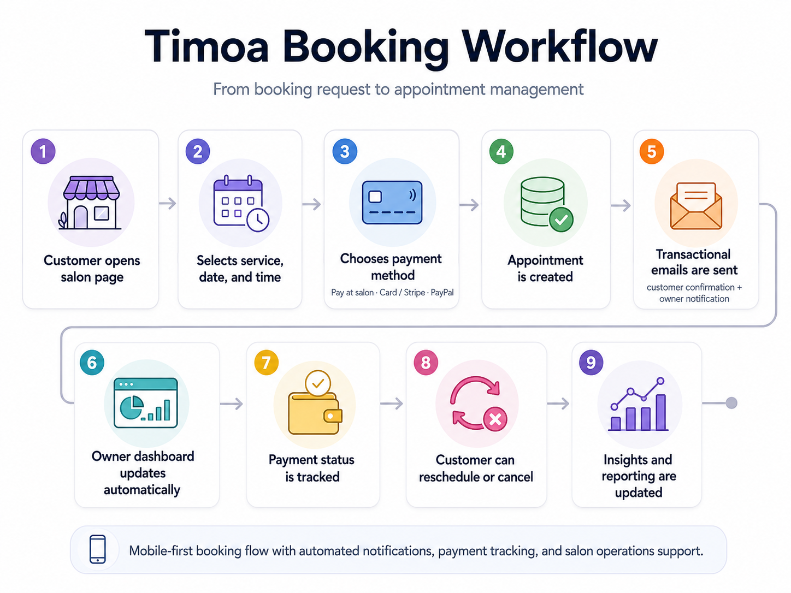

---

## Mobile customer booking flow

The customer-facing booking flow is designed for mobile usage first: customers open the salon page, choose a service, select staff/time, choose a payment method and receive a booking confirmation.

<table>
  <tr>
    <td width="33%">
      <strong>Public salon page</strong><br>
      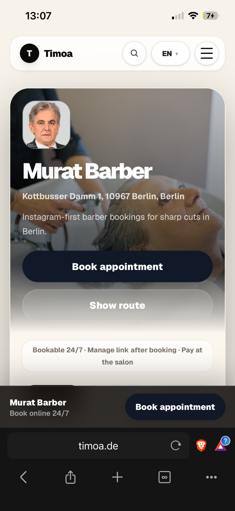
    </td>
    <td width="33%">
      <strong>Public services</strong><br>
      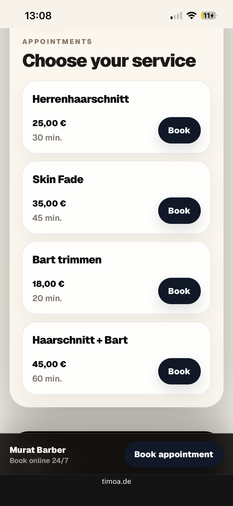
    </td>
    <td width="33%">
      <strong>Service and staff selection</strong><br>
      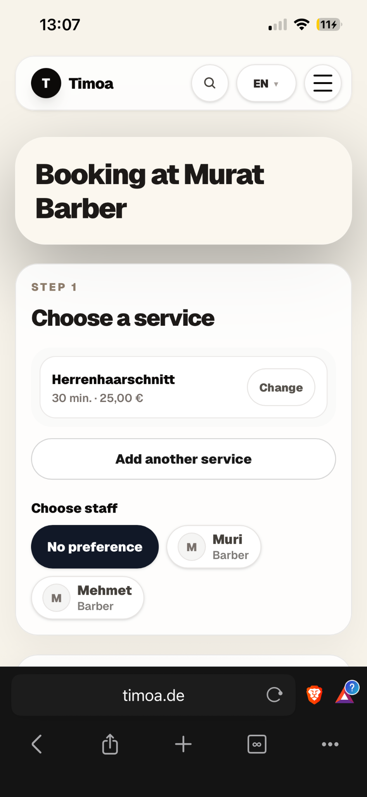
    </td>
  </tr>
</table>

---

## Payment and confirmation flow

Timoa supports multiple payment paths while keeping the customer experience simple and explicit.

<table>
  <tr>
    <td width="33%">
      <strong>Payment selection</strong><br>
      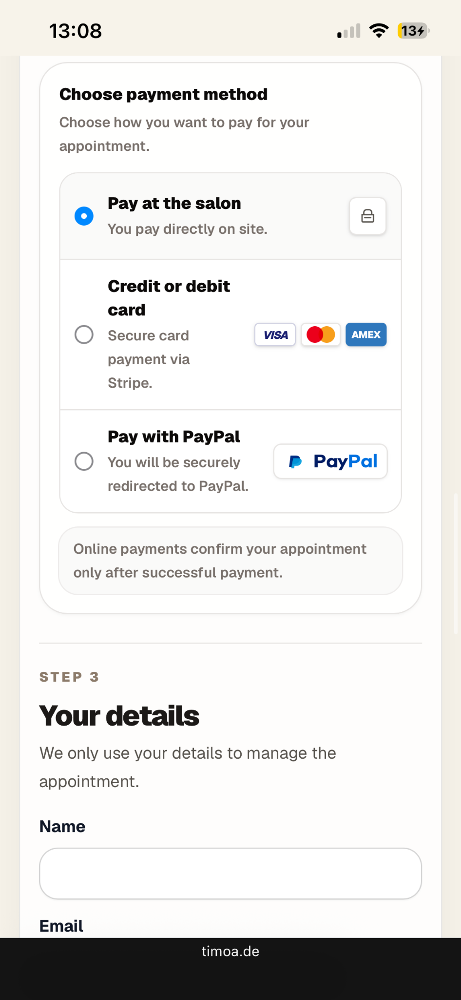
    </td>
    <td width="33%">
      <strong>Booking confirmation</strong><br>
      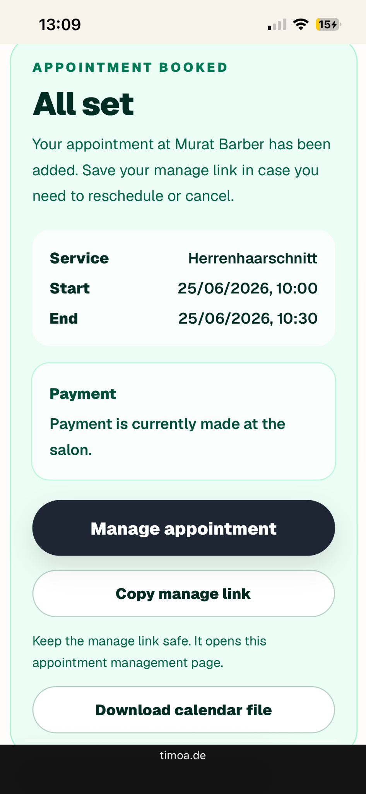
    </td>
    <td width="33%">
      <strong>Transactional email</strong><br>
      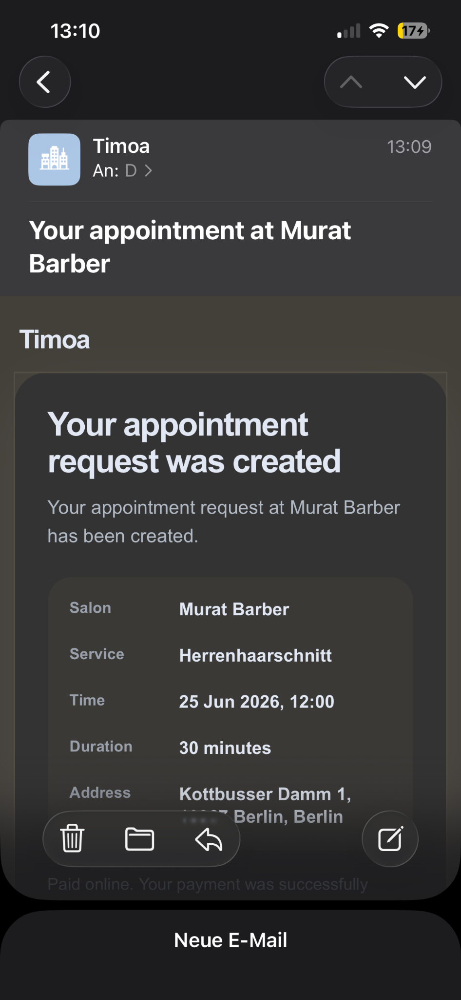
    </td>
  </tr>
</table>

---

## Owner experience

The owner dashboard gives salon owners a structured way to manage bookings, services, opening hours and onboarding.

### Dashboard overview

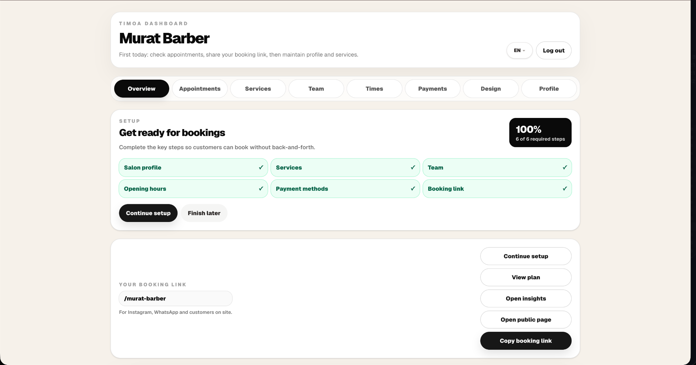

### Owner onboarding

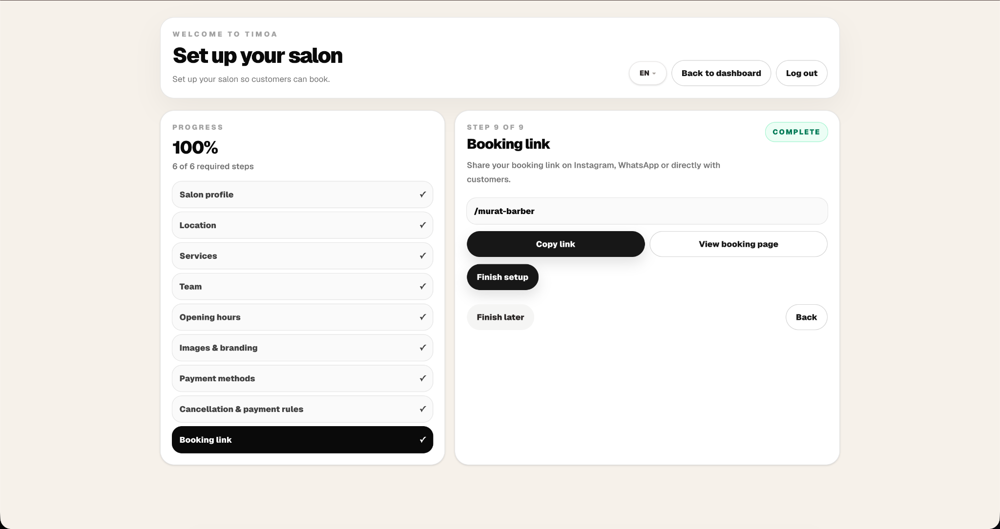

### Services management

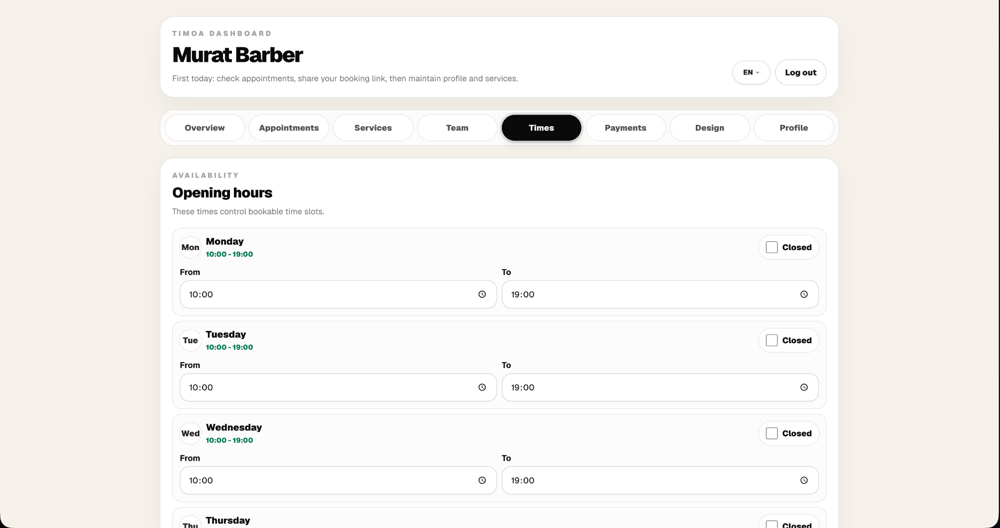

### Opening hours

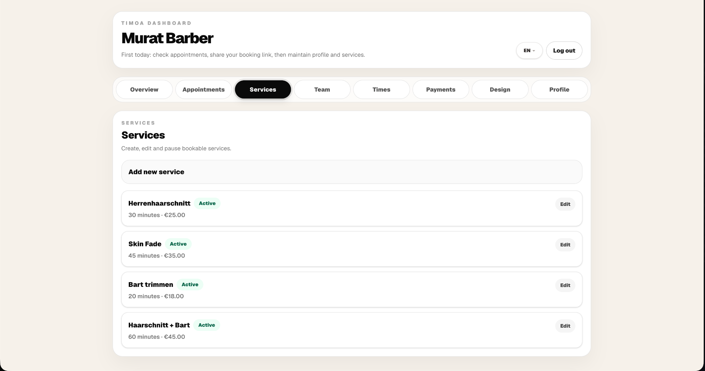

---

## Privacy-conscious insights

Timoa includes an insights dashboard focused on aggregated operational metrics.

It is designed to avoid exposing customer personal data in analytics views.

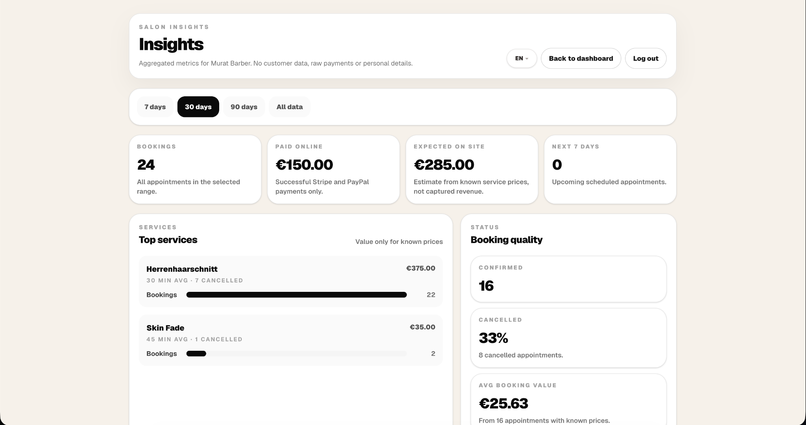

---

## Repository structure

```txt
.
│   ├── cover-letter-auvia-draft.md
│   ├── cover-letter-jupito-draft.md
│   ├── interview-talking-points.md
│   └── target-role-alignment.md
├── code-samples/
│   └── selected cleaned excerpts from the private production codebase
├── docs/
│   ├── ai-automation-fit.md
│   ├── api-webhook-design.md
│   ├── automation-case-study.md
│   ├── process-analysis.md
│   └── n8n-readiness.md
├── screenshots/
│   └── selected product screenshots
├── workflow-blueprints/
│   ├── new-appointment-workflow.md
│   ├── payment-completed-workflow.md
│   └── weekly-salon-insights-workflow.md
├── SECURITY.md
└── README.md
```

---

## Documentation

- [Automation case study](docs/automation-case-study.md)
- [Process analysis](docs/process-analysis.md)
- [n8n readiness and workflow mapping](docs/n8n-readiness.md)
- [API and webhook design](docs/api-webhook-design.md)
- [AI automation fit](docs/ai-automation-fit.md)
- [Architecture](docs/architecture.md)
- [Analytics and privacy](docs/analytics-privacy.md)
- [Pilot learnings](docs/pilot-learnings.md)
- [Review workflow](docs/review-workflow.md)

---

## Workflow blueprints

- [New appointment workflow](workflow-blueprints/new-appointment-workflow.md)
- [Payment completed workflow](workflow-blueprints/payment-completed-workflow.md)
- [Weekly salon insights workflow](workflow-blueprints/weekly-salon-insights-workflow.md)

---

## Repository safety

This repository does not include:

- production credentials
- environment variables
- customer data
- manage tokens
- private pilot notes
- raw payment provider payloads
- private deployment configuration

The production repository remains private.
